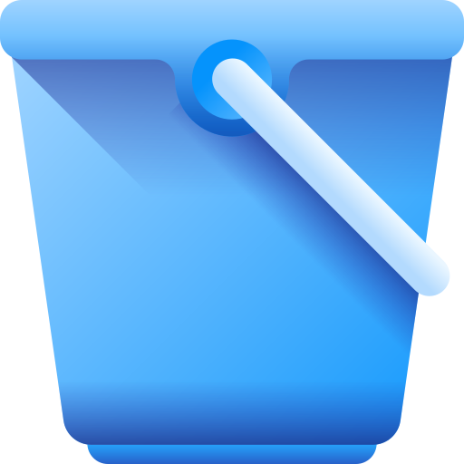

<div align="center">



# Bucket

[](https://github.com/mchave3/Bucket/releases/latest)
[](https://github.com/mchave3/Bucket/releases?q=prerelease%3Atrue)
[](https://github.com/mchave3/Bucket/actions)
[](https://dotnet.microsoft.com/)
[](https://docs.microsoft.com/en-us/windows/apps/winui/)
[](LICENSE)

A modern Windows desktop application built with WinUI 3 and .NET 9

[Download](#download) • [Features](#features) • [Requirements](#requirements) • [Development](#development)

</div>

## Download

### Stable Release
Get the latest stable version from our [releases page](https://github.com/mchave3/Bucket/releases/latest).

### Nightly Builds
Try the latest features with our [nightly builds](https://github.com/mchave3/Bucket/releases?q=prerelease%3Atrue) (updated daily from the `dev` branch).

> [!NOTE]
> Available for **Windows 10 version 1809 (build 17763)** or later on x86, x64, and ARM64 architectures.

## Features

- **Modern UI**: Built with WinUI 3 for a native Windows experience
- **Multi-language Support**: Automatic language detection with English and French localization
- **Cross-Architecture**: Native support for x86, x64, and ARM64 platforms
- **Context Menu Integration**: File Explorer context menu extensions
- **Theming**: Light and dark theme support with system integration

## Requirements

- **OS**: Windows 10 version 1809 (build 17763) or later
- **Runtime**: Included in the self-contained build (no additional installation required)

## Development

### Prerequisites

- [.NET 9.0 SDK](https://dotnet.microsoft.com/download/dotnet/9.0)
- [Visual Studio 2022](https://visualstudio.microsoft.com/) with WinUI 3 workload
- Windows 10 SDK (version 10.0.26100.0 or later)

### Building

```powershell
# Clone the repository
git clone https://github.com/mchave3/Bucket.git
cd Bucket

# Restore dependencies
dotnet restore

# Build the application
dotnet build --configuration Release

# Run tests
dotnet test
```

### Project Structure

- **`src/Bucket.App/`** - Main WinUI 3 application
- **`src/Bucket.Core/`** - Core business logic and services
- **`tests/`** - Unit and integration tests
- **`.github/workflows/`** - CI/CD pipelines for automated builds

### Architecture

The application follows a clean architecture pattern with:

- **MVVM Pattern**: ViewModels handle UI logic and data binding
- **Dependency Injection**: Service-based architecture with IoC container
- **Localization Service**: Automatic OS language detection and resource management
- **Theme Service**: Dynamic theme switching with system integration

## Contributing

Contributions are welcome! Please feel free to submit pull requests or open issues for bugs and feature requests.

## License

This project is licensed under the terms specified in the [LICENSE](LICENSE) file.