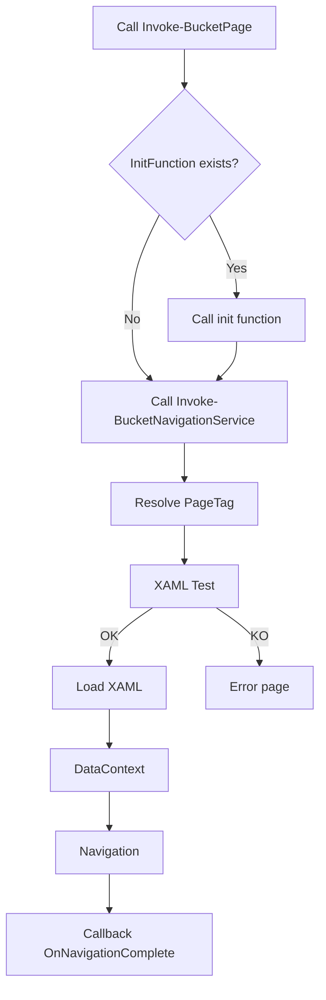

# Page Navigation Logic Documentation (Bucket)

## Introduction
This document provides a detailed explanation of the page navigation logic in the Bucket application (PowerShell + WPF). It is intended for any developer or maintainer who needs to understand, modify, or extend the navigation between GUI pages.

---

## General Principles
- **Centralized Navigation**: All navigation is handled through generic utility functions, mainly `Invoke-BucketNavigationService` and `Invoke-BucketPage`.
- **Modularity**: Functions are designed to work with any WPF window or Frame, with no hard dependency on a single context.
- **Extensibility**: You can add new pages, customize XAML paths, or add post-navigation callbacks.
- **Conventions**: Control, page, and variable names follow strict conventions (see `.github/copilot-instructions.md`).

---

## Detailed Functionality

### 1. `Invoke-BucketNavigationService`
This is the core function that:
- Takes as input a `PageTag` (logical page identifier), a `RootFrame` (target WPF Frame), and various optional parameters (XAML path, page dictionary, DataContext, callback, ...).
- Resolves the page name from the dictionary (`PageDictionary` or `$script:pages`).
- Builds the corresponding XAML file path and checks its existence.
- Dynamically loads the XAML, cleans design-time attributes, and creates the WPF page.
- Manages the DataContext (local + global) for the page.
- Optionally attaches a `PageLoaded` event handler if provided in the DataContext.
- Navigates to the page in the target Frame.
- Calls a post-navigation callback if provided (`OnNavigationComplete`).
- Updates navigation button styles if the function is available.
- Handles errors (logs, fallback to an error page if XAML is missing).

**Example usage:**
```powershell
Invoke-BucketNavigationService -PageTag "homePage" -RootFrame $WPF_MainWindow_RootFrame
```

### 2. `Invoke-BucketPage`
Utility function that:
- Checks if a page-specific initialization function exists (e.g., `Initialize-BucketHomePage`).
- If so, calls it (lets you add page-specific logic before navigation).
- Otherwise, calls `Invoke-BucketNavigationService` with the provided parameters.

**Example usage:**
```powershell
Invoke-BucketPage -PageTag "homePage" -RootFrame $WPF_MainWindow_RootFrame -InitFunction "Initialize-BucketHomePage" -NavigationServiceParams @{ DataContext = $script:globalDataContext }
```

### 3. Page Initialization
For each page, it is recommended to create an initialization function named with the pattern:
```
Initialize-Bucket[PageName]Page
```
This function can prepare the DataContext, attach events, or perform checks before navigation.

---

## Typical Architecture

- **Page Dictionary**:
  - A hashtable `$script:pages` (or passed as a parameter) maps each `PageTag` to a logical page name.
- **XAML Files**:
  - XAML files are organized by module/subfolder; the path can be customized via `-XamlBasePath`.
- **Root Frame**:
  - Each main window has a WPF Frame (e.g., `$WPF_MainWindow_RootFrame`) that acts as the navigation container.
- **DataContext**:
  - Used to pass data and callbacks to the page.

---

## Best Practices & Pitfalls
- Always check for XAML file existence before loading (done automatically by the function).
- Use logs (`Write-BucketLog`) for all important operations or errors.
- Follow naming and organization conventions (see `.github/copilot-instructions.md`).
- Prefer using `Invoke-BucketPage` to benefit from automatic initialization.
- Use callbacks (`OnNavigationComplete`) for post-navigation actions.
- When adding a new window, provide the target Frame and, if needed, a specific page dictionary.

---

## Extension & Customization
- **Add a new page**:
  1. Add the entry in the page dictionary.
  2. Create the corresponding XAML file.
  3. (Optional) Create the initialization function.
- **Customize XAML path**:
  Use the `-XamlBasePath` parameter.
- **Multi-window navigation**:
  Provide the target Frame and, if needed, a window-specific page dictionary.

---

## Simplified Diagram



---

## References
- `.github/copilot-instructions.md` (conventions and best practices)
- `src/Bucket/Private/GUI/Navigation/Invoke-BucketNavigationService.ps1`
- `src/Bucket/Private/GUI/Navigation/Invoke-BucketPage.ps1`

---

## Contact
For questions or suggestions, contact the project maintainer or open an issue on the GitHub repository.
